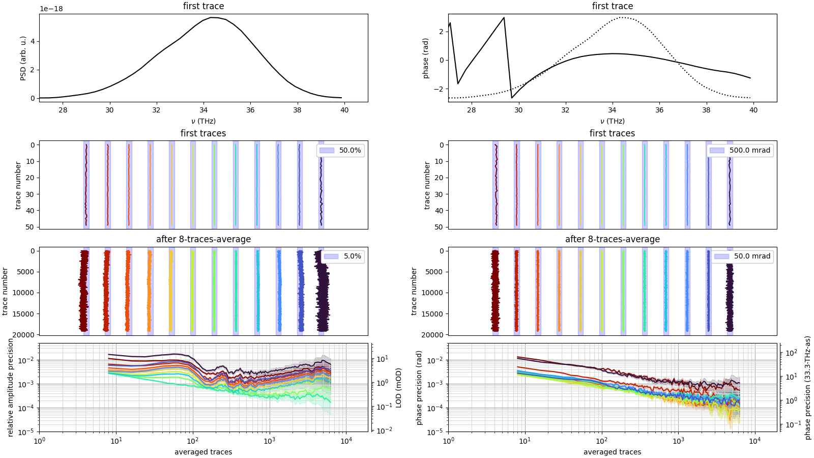

Evaluation of long-term measurements in time-domain spectroscopy / field-resolved spectroscopy:

* Phase and delay of the traces are aligned with each other to get rid of phase or GD drifts before averaging
* Fourier transform of all traces
* History and allan deviations of the resulting spectral bins (both spectral intensity and spectral phase) - quantifies the best achieved precision, optimum measurement time, and serves as a diagnostic for remaining drifts beyond phase and GD.

 

This is a Python package containing useful [chunkiter](https://gitlab.com/leberwurscht/chunkiter) operations and plotting functions for this task, and an example script is also provided (example.py).

Installation:

```
pip3 install git+https://gitlab.com/leberwurscht/frshelpers.git
```
